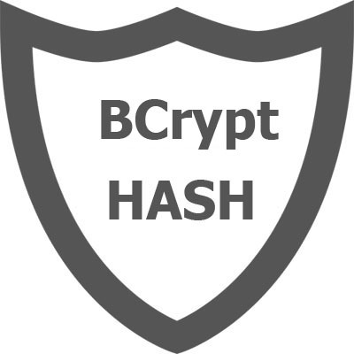

# New age - user profile app

- [Vue-app](https://new-age-42884.firebaseapp.com/).
- [API](https://new-age-api-production.up.railway.app/).

### Table of Contents

- [Prerequisites](#Prerequisites)
- [Tech Stack](#Tech-Stack)
- [Getting Started](#Getting-Started)

#

### Prerequisites

-  Node JS @16.X and up
-  npm @8 and up
-  Typescript @4 and up

#

### Tech Stack

Vue

-  Vue @2.6.14 - front-end framework
-  Vuex @3.6.2 - state management library for Vue
-  Vue-router @3.6.5 - The official router for Vue.js.
-  Scss - is the most mature, stable, and powerful professional grade CSS extension language in the world.
-  Axios @1.2.0 - Promise based HTTP client for the browser and node.js

Node.js

-  bcrypt @5.1.0 - A library to hash passwords
-  dotenv @16.0.3 - zero-dependency module that loads environment variables from a .env file
-  express @4.18.2 - web framework for node
-  joi @17.7.0 - schema description language and data validator for JavaScript
-  jsonwebtoken @8.5.1 - An implementation of JSON Web Tokens
-  mongodb @4.12.1 - document database
-  mongoose @6.7.3 - MongoDB object modeling tool
-  swagger @4.6.0 - module provides tools for designing and building Swagger-compliant APIs entirely in Node.js
-  yaml @0.3.0 - yaml is a definitive library for YAML, the human friendly data serialization standard

#

### Getting Started

1. First of all you need to clone app repository from github:

```
git clone https://github.com/nikanoza/new-age.git
```

2. Next step requires install all the dependencies in vue app after navigate project folder.

```
cd new-age
npm install
```

3. also need install all the dependencies in node.js api app after navigate project folder.

```
cd API
npm install
```

4. to see project in action locale you need to create .env files both project

```
cp .env.example .env
```

5. for node.js app you need to create your own database on mongodb and save connection information into .env variables
6. for vue app you just need to write localhost url where node.js app is running
7. to see project in action you need to run both project same time.
